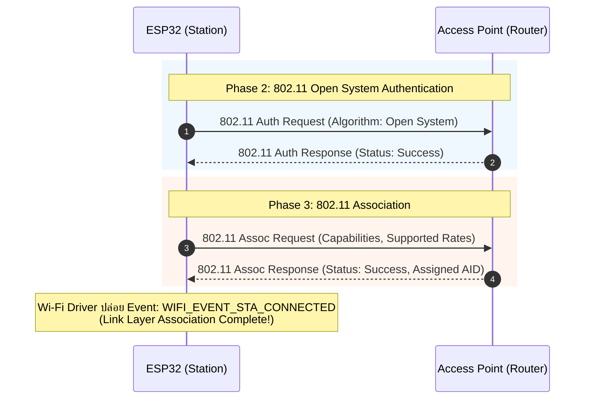
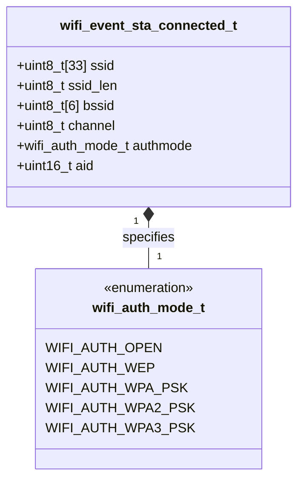

# ใบงานที่ 5.3: การยืนยันตัวตนและการผูกสัมพันธ์ในระดับ Link Layer (Authentication & Association Phase)

## 0. กล่าวนำ (Introduction)
ใบงานนี้มุ่งเน้นศึกษาลงลึกเฉพาะ **เฟสที่ 2: Authentication Phase (การยืนยันตัวตนระดับ Link Layer)** และ **เฟสที่ 3: Association Phase (การผูกสัมพันธ์และการตกลงคุณสมบัติ)** บนเฟรมเวิร์ก ESP-IDF 

เมื่อ ESP32 สแกนพบ AP เป้าหมายแล้ว ขั้นตอนต่อไปคือการเข้าสู่กระบวนการแลกเปลี่ยนเฟรม 802.11 Authentication Request/Response และ 802.11 Association Request/Response เพื่อตกลงคุณสมบัติและรับหมายเลขประจำตัว **Association ID (AID)** จาก AP ก่อนที่จะก้าวเข้าสู่กระบวนการแลกเปลี่ยนคีย์ความปลอดภัย WPA2/WPA3 (4-Way Handshake) ในเฟสถัดไป

---

## 1. วัตถุประสงค์ (Objectives)
1. เรียนรู้กระบวนการทำงานในระดับ Link Layer (Phase 2: Authentication & Phase 3: Association) ตามมาตรฐาน IEEE 802.11
2. ดักจับและสังเกต Event **`WIFI_EVENT_STA_CONNECTED`** ซึ่งเป็นด่านแรกที่ยืนยันว่าการผูกสัมพันธ์ระดับ Link Layer สำเร็จสมบูรณ์
3. อ่านและวิเคราะห์พารามิเตอร์ที่ได้รับจากโครงสร้างข้อมูล `wifi_event_sta_connected_t` ได้แก่ SSID, BSSID (MAC Address), Channel, Authmode และ **Association ID (AID)**
4. จำแนกและวิเคราะห์ความแตกต่างของ Disconnect Reason Code ที่เกิดขึ้นใน Auth Phase (`WIFI_REASON_AUTH_EXPIRE`, `WIFI_REASON_AUTH_FAIL`) และ Assoc Phase (`WIFI_REASON_ASSOC_EXPIRE`, `WIFI_REASON_ASSOC_FAIL`, `WIFI_REASON_ASSOC_TOOMANY`)

---

## 2. อุปกรณ์และซอฟต์แวร์ที่ใช้ในการทดลอง (Equipment & Tools)
1. บอร์ดไมโครคอนโทรลเลอร์ ESP32 (เช่น ESP32 DevKit V1) จำนวน 1 บอร์ด
2. สายเชื่อมต่อ Micro-USB หรือ USB-C จำนวน 1 เส้น
3. คอมพิวเตอร์ที่ติดตั้งโปรแกรม IDE เช่น VS Code พร้อมทั้ง ESP-IDF (อาจจะติดตั้งบนเครื่องหรือบน Docker ก็ได้)

---

## 3. ความรู้พื้นฐานที่เกี่ยวข้อง (Theoretical Background - ESP-IDF Framework)

### 3.1 ลำดับขั้นการทำงานในระดับ Link Layer (Sequence Diagram)



### 3.2 โครงสร้างข้อมูล `wifi_event_sta_connected_t` (Class Diagram)



---

## 4. ขั้นตอนและโปรแกรมทดสอบการทดลอง (Experimental Procedures)

ในใบงานนี้ จะทดสอบสถาปนาความสัมพันธ์ในระดับ Link Layer (Phase 2 & Phase 3) เพื่อสังเกตการณ์ทำงานจนถึง Event `WIFI_EVENT_STA_CONNECTED`

### 5.3.1 การทดสอบสถาปนา Link-Layer (Phase 2 & Phase 3 Success Case)
กำหนดค่า SSID และ Password ของ AP ในพื้นที่จริง สังเกต Forensic Log เมื่อเกิด Event `WIFI_EVENT_STA_CONNECTED` อ่านค่า BSSID, Channel, Authmode และ **Association ID (AID)** ที่ AP มอบหมายให้ ESP32

### 5.3.2 การทดสอบจำลองเหตุการณ์ล้มเหลวในระดับ Link Layer (No AP Found Case)
กำหนดค่า SSID สมมุติที่ไม่มีอยู่จริง (`"NON_EXISTENT_AP_9999"`) สังเกต Forensic Log เพื่อยืนยันว่าการล้มเหลวเกิดขึ้นตั้งแต่ก่อนเข้าสู่ Auth/Assoc Phase (ส่งผลให้ได้ Disconnect Reason `201` / `WIFI_REASON_NO_AP_FOUND`)

---

## 5. ซอร์สโค้ดการทดลอง (Complete ESP-IDF Source Code - `main.c`)

ให้นักศึกษานำซอร์สโค้ด C ต่อไปนี้ไปวางในไฟล์ `main/main.c` ของโปรเจกต์ ESP-IDF ทำการ Build และ Flash ลงบอร์ด ESP32 จากนั้นเปิด ESP-IDF Monitor (Baud Rate `115200`) เพื่อสังเกตผลการทำงาน

==**คำเตือน** SSID และ PASSWORD เป็นข้อมูลส่วนบุคคล ให้ลบออกก่อน push ขึ้น origin repository==

```c
#include <stdio.h>
#include <string.h>
#include "freertos/FreeRTOS.h"
#include "freertos/task.h"
#include "freertos/event_groups.h"
#include "esp_system.h"
#include "esp_wifi.h"
#include "esp_event.h"
#include "esp_log.h"
#include "nvs_flash.h"
#include "esp_netif.h"

static const char *TAG = "LAB_AUTH_ASSOC";

static EventGroupHandle_t s_wifi_event_group;

#define WIFI_CONNECTED_BIT BIT0
#define WIFI_FAIL_BIT      BIT1

#define TARGET_WIFI_SSID   "MY_SSID"
#define TARGET_WIFI_PASS   "MY_PASSWORD"

// Convert wifi_reason_code_t to readable string with phase diagnosis
static const char *get_disconnect_reason_info(uint8_t reason) {
  switch (reason) {
  case WIFI_REASON_UNSPECIFIED:
    return "WIFI_REASON_UNSPECIFIED (1) [Phase 2/3]";
  case WIFI_REASON_AUTH_EXPIRE:
    return "WIFI_REASON_AUTH_EXPIRE (2) [Phase 2: Auth Timeout / Weak Signal]";
  case WIFI_REASON_AUTH_FAIL:
    return "WIFI_REASON_AUTH_FAIL (1/202) [Phase 2: Auth Rejected / MAC Filter]";
  case WIFI_REASON_ASSOC_EXPIRE:
    return "WIFI_REASON_ASSOC_EXPIRE (4) [Phase 3: Assoc Timeout / Packet Loss]";
  case WIFI_REASON_ASSOC_FAIL:
    return "WIFI_REASON_ASSOC_FAIL (3/203) [Phase 3: Assoc Rejected / Mismatch]";
  case WIFI_REASON_ASSOC_TOOMANY:
    return "WIFI_REASON_ASSOC_TOOMANY (5/17) [Phase 3: AP Max Clients Exceeded]";
  case WIFI_REASON_NOT_AUTHED:
    return "WIFI_REASON_NOT_AUTHED (6) [Phase 3: Assoc Sent Before Auth]";
  case WIFI_REASON_NO_AP_FOUND:
    return "WIFI_REASON_NO_AP_FOUND (201) [Phase 1: SSID Not Found]";
  case WIFI_REASON_HANDSHAKE_TIMEOUT:
    return "WIFI_REASON_HANDSHAKE_TIMEOUT (15) [Phase 4: 4-Way Handshake Timeout]";
  case WIFI_REASON_4WAY_HANDSHAKE_TIMEOUT:
    return "WIFI_REASON_4WAY_HANDSHAKE_TIMEOUT (204) [Phase 4: Wrong Password]";
  default:
    return "OTHER_DISCONNECT_REASON";
  }
}

// Event handler focusing on Link-Layer (Auth & Assoc Phase)
static void wifi_event_handler(void *arg, esp_event_base_t event_base,
                               int32_t event_id, void *event_data) {
  if (event_base == WIFI_EVENT) {
    switch (event_id) {
    case WIFI_EVENT_STA_START:
      ESP_LOGI(TAG, "[EVENT FORENSIC]: WIFI_EVENT_STA_START received");
      ESP_LOGI(TAG, "[FORENSIC]: Initiating 802.11 Link-Layer Connection (Auth & Assoc)...");
      ESP_LOGI(TAG, "[FORENSIC]: Call esp_wifi_connect()");
      esp_err_t err_conn = esp_wifi_connect();
      ESP_LOGI(TAG, "[FORENSIC]: esp_wifi_connect() returned %s (0x%x)",
               esp_err_to_name(err_conn), err_conn);
      break;

    case WIFI_EVENT_STA_CONNECTED: {
      wifi_event_sta_connected_t *event =
          (wifi_event_sta_connected_t *)event_data;
      ESP_LOGI(TAG, "=======================================================");
      ESP_LOGI(TAG, "[EVENT FORENSIC]: WIFI_EVENT_STA_CONNECTED received!");
      ESP_LOGI(TAG, "  [SUCCESS]: Phase 2 (Auth) & Phase 3 (Assoc) COMPLETED!");
      ESP_LOGI(TAG, "  -> Connected SSID        : %s", event->ssid);
      ESP_LOGI(TAG, "  -> BSSID (MAC Address)   : %02X:%02X:%02X:%02X:%02X:%02X",
               event->bssid[0], event->bssid[1], event->bssid[2],
               event->bssid[3], event->bssid[4], event->bssid[5]);
      ESP_LOGI(TAG, "  -> Channel               : %d", event->channel);
      ESP_LOGI(TAG, "  -> Auth Mode             : %d", event->authmode);
      ESP_LOGI(TAG, "  -> Association ID (AID)  : %d", event->aid);
      ESP_LOGI(TAG, "=======================================================");
      xEventGroupSetBits(s_wifi_event_group, WIFI_CONNECTED_BIT);
      break;
    }

    case WIFI_EVENT_STA_DISCONNECTED: {
      wifi_event_sta_disconnected_t *event =
          (wifi_event_sta_disconnected_t *)event_data;
      ESP_LOGW(TAG, "=======================================================");
      ESP_LOGW(TAG, "[EVENT FORENSIC]: WIFI_EVENT_STA_DISCONNECTED received!");
      ESP_LOGW(TAG, "  -> Target SSID          : %s", event->ssid);
      ESP_LOGW(TAG, "  -> Reason Code (Decimal): %d", event->reason);
      ESP_LOGW(TAG, "  -> Reason Code (Hex)    : 0x%02X", event->reason);
      ESP_LOGW(TAG, "  -> Reason Diagnosis     : %s",
               get_disconnect_reason_info(event->reason));
      ESP_LOGW(TAG, "=======================================================");
      xEventGroupSetBits(s_wifi_event_group, WIFI_FAIL_BIT);
      break;
    }

    default:
      ESP_LOGI(TAG, "[EVENT FORENSIC]: WIFI_EVENT ID %ld received", event_id);
      break;
    }
  }
}

static void test_auth_assoc_phase(const char *test_title, const char *ssid,
                                  const char *password) {
  ESP_LOGI(TAG, "\n");
  ESP_LOGI(TAG, "------------------------------------------------------------------");
  ESP_LOGI(TAG, ">>> %s", test_title);
  ESP_LOGI(TAG, "------------------------------------------------------------------");
  ESP_LOGI(TAG, "  Target SSID    : \"%s\"", ssid);
  ESP_LOGI(TAG, "  Target Password: \"%s\"", password);

  xEventGroupClearBits(s_wifi_event_group, WIFI_CONNECTED_BIT | WIFI_FAIL_BIT);

  wifi_config_t wifi_config = {
      .sta = {
          .threshold.authmode = WIFI_AUTH_OPEN, // Allow open auth in Link-Layer
      },
  };
  strncpy((char *)wifi_config.sta.ssid, ssid, sizeof(wifi_config.sta.ssid));
  strncpy((char *)wifi_config.sta.password, password,
          sizeof(wifi_config.sta.password));

  ESP_LOGI(TAG, "[FORENSIC]: Call esp_wifi_stop()");
  esp_wifi_stop();

  ESP_LOGI(TAG, "[FORENSIC]: Call esp_wifi_set_config(WIFI_IF_STA, &wifi_config)");
  esp_err_t err_cfg = esp_wifi_set_config(WIFI_IF_STA, &wifi_config);
  ESP_LOGI(TAG, "[FORENSIC]: esp_wifi_set_config() returned %s (0x%x)",
           esp_err_to_name(err_cfg), err_cfg);

  ESP_LOGI(TAG, "[FORENSIC]: Call esp_wifi_start()");
  esp_err_t err_start = esp_wifi_start();
  ESP_LOGI(TAG, "[FORENSIC]: esp_wifi_start() returned %s (0x%x)",
           esp_err_to_name(err_start), err_start);

  EventBits_t bits = xEventGroupWaitBits(s_wifi_event_group,
                                         WIFI_CONNECTED_BIT | WIFI_FAIL_BIT,
                                         pdFALSE, pdFALSE, pdMS_TO_TICKS(8000));

  if (bits & WIFI_CONNECTED_BIT) {
    ESP_LOGI(TAG, "[RESULT]: TEST PASSED - Phase 2 (Auth) & Phase 3 (Assoc) Successful!");
  } else if (bits & WIFI_FAIL_BIT) {
    ESP_LOGW(TAG, "[RESULT]: TEST FAILED - Disconnected event captured in Link-Layer.");
  } else {
    ESP_LOGE(TAG, "[RESULT]: TEST TIMEOUT - Response timeout from AP.");
  }
}

void app_main(void) {
  s_wifi_event_group = xEventGroupCreate();

  // 1. Initialize NVS Flash
  ESP_LOGI(TAG, "[FORENSIC]: Call nvs_flash_init()");
  esp_err_t ret = nvs_flash_init();
  ESP_LOGI(TAG, "[FORENSIC]: nvs_flash_init() returned %s (0x%x)",
           esp_err_to_name(ret), ret);
  if (ret == ESP_ERR_NVS_NO_FREE_PAGES ||
      ret == ESP_ERR_NVS_NEW_VERSION_FOUND) {
    ESP_LOGI(TAG, "[FORENSIC]: Call nvs_flash_erase()");
    ESP_ERROR_CHECK(nvs_flash_erase());
    ret = nvs_flash_init();
    ESP_LOGI(TAG, "[FORENSIC]: nvs_flash_init() retry returned %s (0x%x)",
             esp_err_to_name(ret), ret);
  }
  ESP_ERROR_CHECK(ret);

  // 2. Initialize Network Interface and Event Loop
  ESP_LOGI(TAG, "[FORENSIC]: Call esp_netif_init()");
  ESP_ERROR_CHECK(esp_netif_init());

  ESP_LOGI(TAG, "[FORENSIC]: Call esp_event_loop_create_default()");
  ESP_ERROR_CHECK(esp_event_loop_create_default());

  ESP_LOGI(TAG, "[FORENSIC]: Call esp_netif_create_default_wifi_sta()");
  esp_netif_t *sta_netif = esp_netif_create_default_wifi_sta();
  ESP_LOGI(TAG, "[FORENSIC]: esp_netif_create_default_wifi_sta() returned %p", sta_netif);

  // 3. Initialize Wi-Fi Driver
  wifi_init_config_t cfg = WIFI_INIT_CONFIG_DEFAULT();
  ESP_LOGI(TAG, "[FORENSIC]: Call esp_wifi_init(&cfg)");
  ESP_ERROR_CHECK(esp_wifi_init(&cfg));

  // 4. Register Wi-Fi Event Handler
  esp_event_handler_instance_t instance_any_id;
  ESP_LOGI(TAG, "[FORENSIC]: Call esp_event_handler_instance_register(WIFI_EVENT)");
  ESP_ERROR_CHECK(esp_event_handler_instance_register(
      WIFI_EVENT, ESP_EVENT_ANY_ID, &wifi_event_handler, NULL,
      &instance_any_id));

  ESP_LOGI(TAG, "[FORENSIC]: Call esp_wifi_set_mode(WIFI_MODE_STA)");
  ESP_ERROR_CHECK(esp_wifi_set_mode(WIFI_MODE_STA));

  ESP_LOGI(TAG, "==================================================================");
  ESP_LOGI(TAG, "  Lab 5.3: Wi-Fi Authentication & Association Phase (ESP-IDF Forensic)");
  ESP_LOGI(TAG, "==================================================================");

  // ------------------------------------------------------------------
  // 5.3.1 Auth & Assoc Test with Target AP (Link-Layer Success Case)
  // ------------------------------------------------------------------
  test_auth_assoc_phase("Experiment 5.3.1: Link-Layer Auth & Assoc Phase Test",
                        TARGET_WIFI_SSID, TARGET_WIFI_PASS);

  vTaskDelay(pdMS_TO_TICKS(2000));

  // ------------------------------------------------------------------
  // 5.3.2 Simulated Failure Case: Wrong SSID (Fails at Scan Phase)
  // ------------------------------------------------------------------
  test_auth_assoc_phase("Experiment 5.3.2: Link-Layer Test - Non-Existent AP",
                        "NON_EXISTENT_AP_9999", "12345678");

  ESP_LOGI(TAG, "==================================================================");
  ESP_LOGI(TAG, "  [Phase 2 & Phase 3 Completed: Link-Layer Auth & Assoc Finished]");
  ESP_LOGI(TAG, "==================================================================");
}
```

---

## 6. ตารางบันทึกผลการทดลอง (Experiment Results)

ให้นักศึกษาบันทึกผลลัพธ์จากการสังเกตใน Serial Console ลงในตารางต่อไปนี้:

### 6.1 ตารางสรุปเปรียบเทียบผลการทดลองในระดับ Link Layer

| ข้อการทดลอง | สถานการณ์ทดสอบ                           | Event ที่ได้รับ | ผลการผูกสัมพันธ์ Link Layer | ค่า Association ID (AID) ที่ได้ | Reason Code (ถ้ามี) |
| :---------: | :--------------------------------------- | :-------------: | :-------------------------: | :-----------------------------: | :------------------ |
|  **5.3.1**  | ร้องขอ Auth & Assoc กับ AP มีอยู่จริง    |                 |                             |                                 |                     |
|  **5.3.2**  | ร้องขอ Auth & Assoc กับ AP ไม่มีอยู่จริง |                 |                             |                                 |                     |

### 6.2 บันทึกข้อมูล Link Layer จาก Event `WIFI_EVENT_STA_CONNECTED` (ข้อ 5.3.1)

| พารามิเตอร์ Link Layer | ค่าที่อ่านได้จริงจาก Forensic Log |
| :--- | :--- |
| **SSID** | |
| **BSSID (MAC Address)** | |
| **Channel** | |
| **Auth Mode Enum** | |
| **Association ID (AID)** | |

---

## 7. คำถามท้ายการทดลอง (Post-Lab Questions)

1. **Association ID (AID)** คืออะไร มีบทบาทอย่างไรใน Phase 3 และส่งคืนมาในโครงสร้างข้อมูลตัวแปรใด?
   คำตอบ:หมายเลขที่ AP กำหนดให้ Client หลัง Association สำเร็จ ใช้ระบุ Client ในเครือข่าย และส่งกลับในโครงสร้าง wifi_event_sta_connected_t
3. เหตุใดการเชื่อมต่อ Wi-Fi ความปลอดภัยแบบ WPA2-PSK จึงสามารถผ่าน Phase 2 (Authentication) และ Phase 3 (Association) จนเกิด Event `WIFI_EVENT_STA_CONNECTED` ได้สำเร็จ แม้ผู้ใช้จะป้อนรหัสผ่าน (Password) ผิด?
   คำตอบ:Phase 2–3 ยังตรวจสอบ Password จริงไม่ครบ จึงผ่าน Authentication และ Association ได้ และเกิด WIFI_EVENT_STA_CONNECTED ก่อนที่จะไปตรวจสอบ Password จริงใน 4-Way Handshake
4. หาก Router มีการตั้งค่า **MAC Address Filtering** (อนุญาตเฉพาะ MAC ที่ลงทะเบียน) ESP32 จะล้มเหลวในเฟสใด และจะส่ง Disconnect Reason Code ใดออกมา?
   คำตอบ:ESP32 จะล้มเหลวใน Phase 3 (Association) เพราะ Router ไม่อนุญาต MAC ดังกล่าว โดยมักเกิด Disconnect Reason Code 1 (UNSPECIFIED) หรือขึ้นกับ AP/การตอบปฏิเสธ Association
6. สรุปความแตกต่างสำคัญระหว่างจุดสิ้นสุดของ **Phase 3 (Link-Layer Connected)** กับจุดสิ้นสุดของ **Phase 5 (IP Address Assigned)**
   คำตอบ:1.Phase 3: เชื่อมต่อ Wi-Fi กับ AP สำเร็จในระดับ Link Layer (Layer 2) แต่ยังไม่มี IP 2.Phase 5: ได้รับ IP Address แล้ว สามารถสื่อสารผ่านเครือข่ายระดับ IP Layer (Layer 3) ได้

** command log **

```
Running idf_monitor in directory /Users/cheen/Week-05-Wi-Fi-ESP32/wi-fi
Executing "/Users/cheen/.espressif/python_env/idf5.5_py3.13_env/bin/python /Users/cheen/esp/v5.5.1/esp-idf/tools/idf_monitor.py -p /dev/cu.usbserial-0001 -b 115200 --toolchain-prefix xtensa-esp32-elf- --target esp32 --revision 0 /Users/cheen/Week-05-Wi-Fi-ESP32/wi-fi/build/wi-fi.elf /Users/cheen/Week-05-Wi-Fi-ESP32/wi-fi/build/bootloader/bootloader.elf -m '/Users/cheen/.espressif/python_env/idf5.5_py3.13_env/bin/python' '/Users/cheen/esp/v5.5.1/esp-idf/tools/idf.py'"...
--- esp-idf-monitor 1.7.0 on /dev/cu.usbserial-0001 115200
--- Quit: Ctrl+] | Menu: Ctrl+T | Help: Ctrl+T followed by Ctrl+H
 boot: chip revision: v3.1
.W�����Table:sp32: SPI Speed      : 40MHz
I (52) boot: ## Label            Usage          Type ST Offset   Length
I (58) boot:  0 nvs              WiFi data        01 02 00009000 00006000
I (65) boot:  1 phy_init         RF data   �ets Jul 29 2019 12:21:46

rst:0x1 (POWERON_RESET),boot:0x13 (SPI_FAST_FLASH_BOOT)
configsip: 0, SPIWP:0xee
clk_drv:0x00,q_drv:0x00,d_drv:0x00,cs0_drv:0x00,hd_drv:0x00,wp_drv:0x00
mode:DIO, clock div:2
load:0x3fff0030,len:6380
ho 0 tail 12 room 4
load:0x40078000,len:15916
load:0x40080400,len:3860
--- 0x40080400: _invalid_pc_placeholder at /Users/cheen/esp/v5.5.1/esp-idf/components/xtensa/xtensa_vectors.S:2235
entry 0x40080638
--- 0x40080638: call_start_cpu0 at /Users/cheen/esp/v5.5.1/esp-idf/components/bootloader/subproject/main/bootloader_start.c:25
I (29) boot: ESP-IDF v5.5.1-dirty 2nd stage bootloader
I (29) boot: compile time Aug  3 2026 09:42:36
I (29) boot: Multicore bootloader
I (31) boot: chip revision: v3.1
I (34) boot.esp32: SPI Speed      : 40MHz
I (38) boot.esp32: SPI Mode       : DIO
I (41) boot.esp32: SPI Flash Size : 2MB
I (45) boot: Enabling RNG early entropy source...
I (49) boot: Partition Table:
I (52) boot: ## Label            Usage          Type ST Offset   Length
I (58) boot:  0 nvs              WiFi data        01 02 00009000 00006000
I (65) boot:  1 phy_init         RF data          01 01 0000f000 00001000
I (71) boot:  2 factory          factory app      00 00 00010000 00100000
I (78) boot: End of partition table
I (81) esp_image: segment 0: paddr=00010020 vaddr=3f400020 size=19e48h (106056) map
I (125) esp_image: segment 1: paddr=00029e70 vaddr=3ffb0000 size=03eech ( 16108) load
I (131) esp_image: segment 2: paddr=0002dd64 vaddr=40080000 size=022b4h (  8884) load
I (135) esp_image: segment 3: paddr=00030020 vaddr=400d0020 size=860fch (549116) map
I (324) esp_image: segment 4: paddr=000b6124 vaddr=400822b4 size=15b58h ( 88920) load
I (359) esp_image: segment 5: paddr=000cbc84 vaddr=50000000 size=00020h (    32) load
I (370) boot: Loaded app from partition at offset 0x10000
I (371) boot: Disabling RNG early entropy source...
I (381) cpu_start: Multicore app
I (390) cpu_start: Pro cpu start user code
I (390) cpu_start: cpu freq: 160000000 Hz
I (390) app_init: Application information:
I (390) app_init: Project name:     wi-fi
I (393) app_init: App version:      37de524-dirty
I (398) app_init: Compile time:     Aug  3 2026 09:42:27
I (403) app_init: ELF file SHA256:  6582cf3fc...
I (407) app_init: ESP-IDF:          v5.5.1-dirty
I (412) efuse_init: Min chip rev:     v0.0
I (415) efuse_init: Max chip rev:     v3.99 
I (419) efuse_init: Chip rev:         v3.1
I (423) heap_init: Initializing. RAM available for dynamic allocation:
I (430) heap_init: At 3FFAE6E0 len 00001920 (6 KiB): DRAM
I (435) heap_init: At 3FFB7FD0 len 00028030 (160 KiB): DRAM
I (440) heap_init: At 3FFE0440 len 00003AE0 (14 KiB): D/IRAM
I (445) heap_init: At 3FFE4350 len 0001BCB0 (111 KiB): D/IRAM
I (451) heap_init: At 40097E0C len 000081F4 (32 KiB): IRAM
I (458) spi_flash: detected chip: generic
I (460) spi_flash: flash io: dio
W (463) spi_flash: Detected size(4096k) larger than the size in the binary image header(2048k). Using the size in the binary image header.
I (476) main_task: Started on CPU0
I (486) main_task: Calling app_main()
I (486) LAB_AUTH_ASSOC: [FORENSIC]: Call nvs_flash_init()
I (506) LAB_AUTH_ASSOC: [FORENSIC]: nvs_flash_init() returned ESP_OK (0x0)
I (506) LAB_AUTH_ASSOC: [FORENSIC]: Call esp_netif_init()
I (506) LAB_AUTH_ASSOC: [FORENSIC]: Call esp_event_loop_create_default()
I (516) LAB_AUTH_ASSOC: [FORENSIC]: Call esp_netif_create_default_wifi_sta()
I (516) LAB_AUTH_ASSOC: [FORENSIC]: esp_netif_create_default_wifi_sta() returned 0x3ffbd940
I (526) LAB_AUTH_ASSOC: [FORENSIC]: Call esp_wifi_init(&cfg)
I (546) wifi:wifi driver task: 3ffc002c, prio:23, stack:6656, core=0
I (556) wifi:wifi firmware version: 14da9b7
I (556) wifi:wifi certification version: v7.0
I (556) wifi:config NVS flash: enabled
I (556) wifi:config nano formatting: disabled
I (566) wifi:Init data frame dynamic rx buffer num: 32
I (566) wifi:Init static rx mgmt buffer num: 5
I (566) wifi:Init management short buffer num: 32
I (576) wifi:Init dynamic tx buffer num: 32
I (576) wifi:Init static rx buffer size: 1600
I (586) wifi:Init static rx buffer num: 10
I (586) wifi:Init dynamic rx buffer num: 32
I (596) wifi_init: rx ba win: 6
I (596) wifi_init: accept mbox: 6
I (596) wifi_init: tcpip mbox: 32
I (596) wifi_init: udp mbox: 6
I (606) wifi_init: tcp mbox: 6
I (606) wifi_init: tcp tx win: 5760
I (606) wifi_init: tcp rx win: 5760
I (616) wifi_init: tcp mss: 1440
I (616) wifi_init: WiFi IRAM OP enabled
I (616) wifi_init: WiFi RX IRAM OP enabled
I (626) LAB_AUTH_ASSOC: [FORENSIC]: Call esp_event_handler_instance_register(WIFI_EVENT)
I (626) LAB_AUTH_ASSOC: [FORENSIC]: Call esp_wifi_set_mode(WIFI_MODE_STA)
I (636) LAB_AUTH_ASSOC: ==================================================================
I (646) LAB_AUTH_ASSOC:   Lab 5.3: Wi-Fi Authentication & Association Phase (ESP-IDF Forensic)
I (656) LAB_AUTH_ASSOC: ==================================================================
I (656) LAB_AUTH_ASSOC: 

I (666) LAB_AUTH_ASSOC: ------------------------------------------------------------------
I (666) LAB_AUTH_ASSOC: >>> Experiment 5.3.1: Link-Layer Auth & Assoc Phase Test
I (676) LAB_AUTH_ASSOC: ------------------------------------------------------------------
I (686) LAB_AUTH_ASSOC:   Target SSID    : "😑"
I (686) LAB_AUTH_ASSOC:   Target Password: "ัyouec6766"
I (696) LAB_AUTH_ASSOC: [FORENSIC]: Call esp_wifi_stop()
I (696) LAB_AUTH_ASSOC: [FORENSIC]: Call esp_wifi_set_config(WIFI_IF_STA, &wifi_config)
W (706) wifi:Password length matches WPA2 standards, authmode threshold changes from OPEN to WPA2
I (756) LAB_AUTH_ASSOC: [FORENSIC]: esp_wifi_set_config() returned ESP_OK (0x0)
I (756) LAB_AUTH_ASSOC: [FORENSIC]: Call esp_wifi_start()
I (756) phy_init: phy_version 4861,b71b5ad,Aug  5 2025,11:16:06
I (846) phy_init: Saving new calibration data due to checksum failure or outdated calibration data, mode(0)
I (866) wifi:mode : sta (14:33:5c:0d:d5:4c)
I (866) wifi:enable tsf
I (866) LAB_AUTH_ASSOC: [EVENT FORENSIC]: WIFI_EVENT ID 43 received
I (866) LAB_AUTH_ASSOC: [FORENSIC]: esp_wifi_start() returned ESP_OK (0x0)
I (866) LAB_AUTH_ASSOC: [EVENT FORENSIC]: WIFI_EVENT_STA_START received
I (876) LAB_AUTH_ASSOC: [FORENSIC]: Initiating 802.11 Link-Layer Connection (Auth & Assoc)...
I (886) LAB_AUTH_ASSOC: [FORENSIC]: Call esp_wifi_connect()
I (896) LAB_AUTH_ASSOC: [FORENSIC]: esp_wifi_connect() returned ESP_OK (0x0)
I (1176) wifi:new:<11,0>, old:<1,0>, ap:<255,255>, sta:<11,0>, prof:1, snd_ch_cfg:0x0
I (1176) wifi:state: init -> auth (0xb0)
I (1186) LAB_AUTH_ASSOC: [EVENT FORENSIC]: WIFI_EVENT ID 43 received
I (1246) wifi:state: auth -> assoc (0x0)
I (1256) wifi:state: assoc -> run (0x10)
I (4576) wifi:state: run -> init (0xf00)
I (4586) wifi:new:<11,0>, old:<11,0>, ap:<255,255>, sta:<11,0>, prof:1, snd_ch_cfg:0x0
W (4586) LAB_AUTH_ASSOC: =======================================================
W (4586) LAB_AUTH_ASSOC: [EVENT FORENSIC]: WIFI_EVENT_STA_DISCONNECTED received!
W (4596) LAB_AUTH_ASSOC:   -> Target SSID          : 😑
W (4606) LAB_AUTH_ASSOC:   -> Reason Code (Decimal): 15
W (4606) LAB_AUTH_ASSOC:   -> Reason Code (Hex)    : 0x0F
W (4616) LAB_AUTH_ASSOC:   -> Reason Diagnosis     : WIFI_REASON_4WAY_HANDSHAKE_TIMEOUT (204) [Phase 4: Wrong Password]
W (4626) LAB_AUTH_ASSOC: =======================================================
W (4626) LAB_AUTH_ASSOC: [RESULT]: TEST FAILED - Disconnected event captured in Link-Layer.
I (6636) LAB_AUTH_ASSOC: 

I (6636) LAB_AUTH_ASSOC: ------------------------------------------------------------------
I (6636) LAB_AUTH_ASSOC: >>> Experiment 5.3.2: Link-Layer Test - Non-Existent AP
I (6636) LAB_AUTH_ASSOC: ------------------------------------------------------------------
I (6646) LAB_AUTH_ASSOC:   Target SSID    : "NON_EXISTENT_AP_9999"
I (6656) LAB_AUTH_ASSOC:   Target Password: "12345678"
I (6656) LAB_AUTH_ASSOC: [FORENSIC]: Call esp_wifi_stop()
I (6666) LAB_AUTH_ASSOC: [EVENT FORENSIC]: WIFI_EVENT ID 3 received
I (6666) wifi:flush txq
I (6666) wifi:stop sw txq
I (6676) wifi:lmac stop hw txq
I (6676) LAB_AUTH_ASSOC: [FORENSIC]: Call esp_wifi_set_config(WIFI_IF_STA, &wifi_config)
W (6686) wifi:Password length matches WPA2 standards, authmode threshold changes from OPEN to WPA2
I (6726) LAB_AUTH_ASSOC: [FORENSIC]: esp_wifi_set_config() returned ESP_OK (0x0)
I (6726) LAB_AUTH_ASSOC: [FORENSIC]: Call esp_wifi_start()
I (6726) wifi:mode : sta (14:33:5c:0d:d5:4c)
I (6736) wifi:enable tsf
I (6736) LAB_AUTH_ASSOC: [EVENT FORENSIC]: WIFI_EVENT ID 43 received
I (6736) LAB_AUTH_ASSOC: [EVENT FORENSIC]: WIFI_EVENT_STA_START received
I (6746) LAB_AUTH_ASSOC: [FORENSIC]: Initiating 802.11 Link-Layer Connection (Auth & Assoc)...
I (6756) LAB_AUTH_ASSOC: [FORENSIC]: Call esp_wifi_connect()
I (6766) LAB_AUTH_ASSOC: [FORENSIC]: esp_wifi_connect() returned ESP_OK (0x0)
I (6736) LAB_AUTH_ASSOC: [FORENSIC]: esp_wifi_start() returned ESP_OK (0x0)
W (9176) LAB_AUTH_ASSOC: =======================================================
W (9176) LAB_AUTH_ASSOC: [EVENT FORENSIC]: WIFI_EVENT_STA_DISCONNECTED received!
W (9176) LAB_AUTH_ASSOC:   -> Target SSID          : NON_EXISTENT_AP_9999
W (9186) LAB_AUTH_ASSOC:   -> Reason Code (Decimal): 201
W (9186) LAB_AUTH_ASSOC:   -> Reason Code (Hex)    : 0xC9
W (9196) LAB_AUTH_ASSOC:   -> Reason Diagnosis     : WIFI_REASON_NO_AP_FOUND (201) [Phase 1: SSID Not Found]
W (9206) LAB_AUTH_ASSOC: =======================================================
W (9206) LAB_AUTH_ASSOC: [RESULT]: TEST FAILED - Disconnected event captured in Link-Layer.
I (9216) LAB_AUTH_ASSOC: ==================================================================
I (9226) LAB_AUTH_ASSOC:   [Phase 2 & Phase 3 Completed: Link-Layer Auth & Assoc Finished]
I (9236) LAB_AUTH_ASSOC: ==================================================================
I (9246) main_task: Returned from app_main()
```
