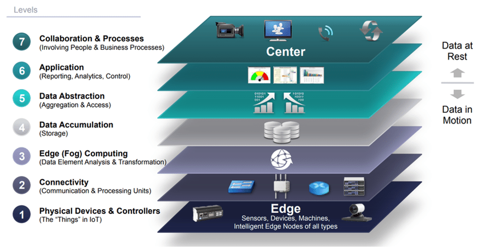
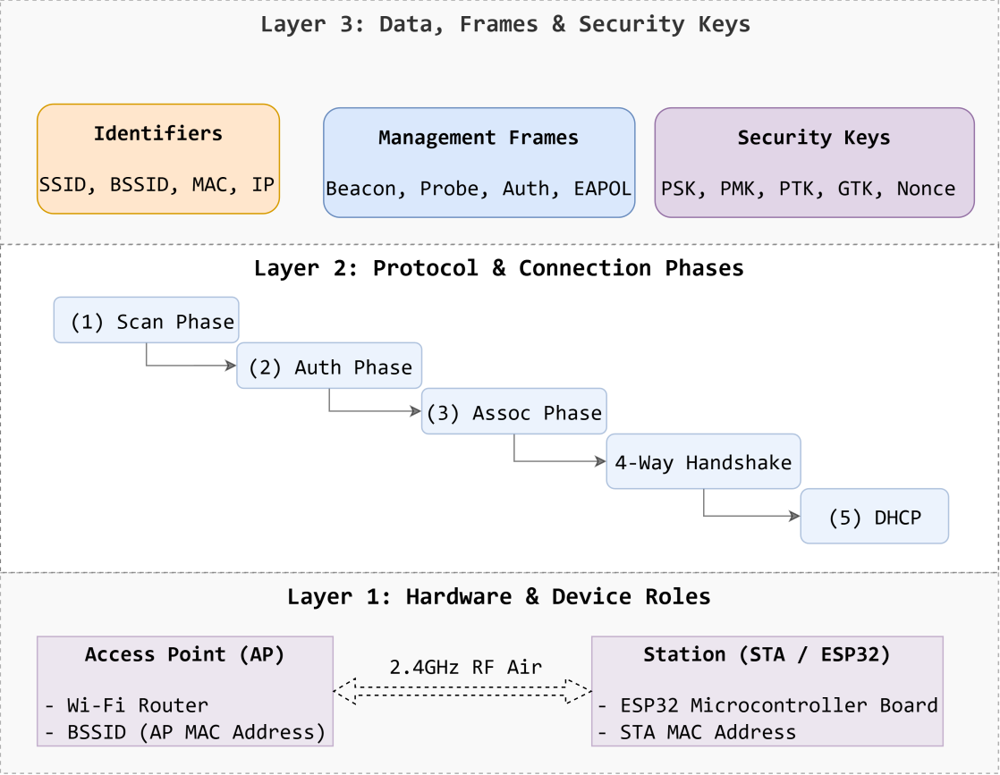

# Week 05: Wi-Fi ESP32 Connection Architecture

## 1. เทคโนโลยี Network สำหรับงาน IoT (IoT Network Technologies)

อุปกรณ์ IoT ในปัจจุบันจำเป็นต้องทำงานภายใต้สภาพแวดล้อมและข้อจำกัดที่หลากหลาย เช่น ข้อจำกัดด้านพลังงาน (Battery-powered), ระยะทางในการสื่อสาร, และปริมาณข้อมูลที่ต้องการรับส่ง (Throughput/Bandwidth) ด้วยเหตุนี้ จึงเกิดเทคโนโลยีการเชื่อมต่อ (Connectivity Stack) ที่ถูกออกแบบมาเพื่อรองรับการใช้งานในมิติต่าง ๆ

### 1.1 การเปรียบเทียบ Network Stack ในงาน IoT

| เทคโนโลยี (Protocol) | สถาปัตยกรรม Stack | ระยะทางการสื่อสาร | อัตราการรับส่งข้อมูล (Data Rate) | อัตราการกินพลังงาน | ลักษณะงานที่เหมาะสม |
| :--- | :--- | :--- | :--- | :--- | :--- |
| **Wi-Fi** | TCP/IP Stack (IEEE 802.11) | ~30 - 100 เมตร | สูงมาก (11 - 600+ Mbps) | สูง | Smart Home, Video Streaming, Real-time Data |
| **Bluetooth LE (BLE)** | GATT/GAP (IEEE 802.15.1) | ~10 - 50 เมตร | ปานกลาง (1 - 2 Mbps) | ต่ำมาก | Wearables, Health Trackers, Smart Locks |
| **LoRaWAN** | MAC + Network Server | 2 - 15 กิโลเมตร | ต่ำมาก (0.3 - 50 kbps) | ต่ำมาก | Smart Agriculture, Environmental Sensors |
| **NB-IoT** | Cellular Stack (3GPP) | 1 - 10 กิโลเมตร | ต่ำ (20 - 250 kbps) | ต่ำ | Smart Metering, Asset Tracking ในเมือง |
| **Zigbee** | IEEE 802.15.4 Stack | ~10 - 100 เมตร (Mesh) | ปานกลาง (250 kbps) | ต่ำ | Smart Building, Lighting Control |
| **Ethernet** | TCP/IP Stack (IEEE 802.3) | ~100 เมตร (Wired) | สูงมาก (100 - 1000 Mbps) | ปานกลาง | Industrial IoT, Edge Gateway ที่ต้องการความเสถียรสูง |

---

## 1.2 ทำไมต้องศึกษา Wi-Fi -> TCP/IP Stack?

ในสัปดาห์นี้ เราจะมุ่งเน้นการศึกษา **Wi-Fi (IEEE 802.11) ร่วมกับ TCP/IP Stack** บนไมโครคอนโทรลเลอร์ **ESP32** โดยมีเหตุผลสำคัญดังนี้:

1. **ความสะดวกในการเชื่อมต่อและโครงสร้างพื้นฐานเดิม (Infrastructure Ready)**: สามารถเชื่อมต่อกับ Access Point (Router) ที่มีอยู่แล้วได้ทันที ไม่ต้องจัดเตรียมโครงสร้างเครือข่ายใหม่ เช่น ไม่ต้องลากสายแลน
2. **รองรับอุปกรณ์จำนวนมาก และแบนด์วิดท์สูง**: เหมาะสำหรับการรับส่งข้อมูลขนาดใหญ่ ส่งไฟล์ อัปเดต Firmware (OTA) หรือเชื่อมต่อ Protocol ระดับ Application เช่น HTTP, WebSockets, และ MQTT
3. **การจัดการแบบไดนามิก (Dynamic Reconnection)**: อุปกรณ์สามารถตัดการเชื่อมต่อ สลับ Access Point หรือเชื่อมต่อใหม่ได้โดยไม่กระทบกับอุปกรณ์อื่นในเครือข่าย
4. **การรวมเน็ตเวิร์กเข้ากับอินเทอร์เน็ตโดยตรง (Native IP Connectivity)**: ไม่จำเป็นต้องมี Gateway แปลง Protocol พิเศษ สามารถส่งข้อมูลไปยัง Cloud Server หรือ Local Server ผ่าน IP Address ได้โดยตรง
5. **นิเวศวิทยาของซอฟต์แวร์และฮาร์ดแวร์ที่แพร่หลาย**: ESP32 มี Wi-Fi Driver และ TCP/IP Stack (lwIP) ที่บูรณาการมาอย่างสมบูรณ์แบบใน ESP-IDF และ Arduino Core

## 1.3 วิเคราะห์สถาปัตยกรรม H/W, Protocol และ Data (Architecture Taxonomy)

ในการเรียนรู้เรื่องการเชื่อมต่อ Wi-Fi ผู้เรียนมักจะเกิดความสับสนระหว่าง **ตัวอุปกรณ์ (Hardware/Role)**, **ข้อกำหนดการสื่อสาร (Protocol)** และ **ข้อมูล/แพ็กเกจที่ส่ง (Data/Frame/Identifier)** 
เพื่อให้เห็นภาพรวมได้ง่ายขึ้น เราสามารถแบ่งเป็น layer ได้ดังรูปต่อไปนี้

**ความหมายของศัพท์และตัวย่อในรูป**

| 1. อุปกรณ์ / บทบาท (Hardware & Role)                             | 2. โปรโตคอล / มาตรฐาน (Protocol & Standard)               | 3. ข้อมูล / แพ็กเกจ / รหัสระบุตัวตน (Data, Frame & Key) |
| :--------------------------------------------------------------- | :-------------------------------------------------------- | :------------------------------------------------------ |
| **AP (Access Point)** - อุปกรณ์ตัวกลางกระจายสัญญาณ (เช่น Router) | **IEEE 802.11** - มาตรฐานเครือข่ายไร้สาย (Wi-Fi)          | **SSID** - ชื่อเครือข่าย Wi-Fi                          |
| **STA (Station)** - อุปกรณ์ลูกข่ายที่ขอเชื่อมต่อ (เช่น ESP32)    | **WPA2 / WPA3** - โปรโตคอลความปลอดภัยและการเข้ารหัส       | **BSSID** - หมายเลข MAC Address ของ AP                  |
| **ESP32** - ไมโครคอนโทรลเลอร์ H/W ที่มี Wi-Fi Radio ในตัว        | **EAPOL** - โปรโตคอลแลกเปลี่ยนคีย์ความปลอดภัยระดับ L2     | **MAC Address** - หมายเลขประจำ H/W เครือข่าย            |
| **Wireless Radio (Antenna)** - ภาคส่งรับคลื่นวิทยุ 2.4GHz        | **TCP/IP** - โปรโตคอลสื่อสารระดับ Network/Transport Layer | **RSSI** - ความแรงของสัญญาณวิทยุ (dBm)                  |
|                                                                  | **DHCP** - โปรโตคอลจัดสรรหมายเลข IP Address อัตโนมัติ     | **Beacon Frame** - แพ็กเกจประกาศตัวตนของ AP             |
|                                                                  | **lwIP** - Lightweight TCP/IP Stack บน ESP32              | **Probe / Auth / Assoc Frame** - แพ็กเกจส่งคำร้องขอ     |
|                                                                  |                                                           | **PSK / PMK / PTK / GTK** - คีย์และรหัสผ่านเข้ารหัสลับ  |
|                                                                  |                                                           | **IP Address** - หมายเลขประจำเครื่องในระดับ Layer 3     |

---

## 2. เนื้อหาสัปดาห์ที่ 5 (Lesson Roadmap)

เนื้อหาการเรียนรู้ในสัปดาห์นี้จะเจาะลึกกระบวนการทำงานเบื้องหลังของ ESP32 ขณะสถาปนาการเชื่อมต่อ Wi-Fi ตั้งแต่เริ่มต้นจนได้ IP Address โดยแบ่งออกเป็น 5 บทเรียนหลัก

1. **[01-Phase-of-WiFi-Connection.md](01-Phase-of-WiFi-Connection.md)** - ภาพรวมและสถาปัตยกรรม Event Loop ของการเชื่อมต่อ Wi-Fi
2. **[02-1-Scan-phase.md](02-1-Scan-phase.md)** - เฟสที่ 1: Scan Phase (ค้นหา Access Point)
3. **[03-2-Auth-Phase.md](03-2-Auth-Phase.md)** - เฟสที่ 2: Authentication Phase (การยืนยันตัวตนระดับ Link Layer)
4. **[04-3-Association Phase.md](04-3-Association%20Phase.md)** - เฟสที่ 3: Association Phase (การผูกสัมพันธ์และการตกลงคุณสมบัติ)
5. **[05-4-Four-way Handshake Phase.md](05-4-Four-way%20Handshake%20Phase.md)** - เฟสที่ 4: Four-way Handshake Phase (การแลกเปลี่ยนคีย์ความปลอดภัย WPA2/WPA3 & การรับ IP Address)
6. **[06-Glossary.md](06-Glossary.md)** - อภิธานศัพท์ คำย่อ และนิยามทางเทคนิค (Glossary of Terms)

---
## 3. ใบงานสัปดาห์ที่ 5

ใบงานในสัปดาห์ที่ 5 จะช่วยให้นักศึกษาได้เข้าใจถึงขั้นตอนในการเชื่อมต่อ Wi-Fi ของ ESP32 (หรืออุปกรณ์ Microcontroller อื่นๆ) กับ Access Point (Router) โดยจะมีการอธิบายทั้งในส่วนของทฤษฎีและปฏิบัติการ โดยแบ่งออกเป็น 4 ใบงานย่อย ดังนี้

1. **[07-Labsheet-05-1-Wi-Fi-Scan-Phase.md](07-Labsheet-05-1-Wi-Fi-Scan-Phase.md)** - ใบงานที่ 5.1: การเชื่อมต่อ Wi-Fi และการค้นหาสัญญาณรอบข้าง (Wi-Fi Connection and Scanning)
2. **[08-Labsheet-05-2-Wi-Fi-Auth-Phase.md](08-Labsheet-05-2-Wi-Fi-Auth-Phase.md)** - ใบงานที่ 5.2: การเชื่อมต่อ Wi-Fi (Wi-Fi Authentication Phase)
3. **[09-Labsheet-05-3-Wi-Fi-Assoc-Phase.md](09-Labsheet-05-3-Wi-Fi-Assoc-Phase.md)** - ใบงานที่ 5.3: การเชื่อมต่อ Wi-Fi (Wi-Fi Association Phase)
4. **[10-Labsheet-05-4-Wi-Fi-Handshake-IP-Phase.md](10-Labsheet-05-4-Wi-Fi-Handshake-IP-Phase.md)** - ใบงานที่ 5.4: การเชื่อมต่อ Wi-Fi (Wi-Fi Handshake and IP Address Acquisition Phase)

---

ปรับปรุงล่าสุด 3 สิงหาคม 2569

--- 
